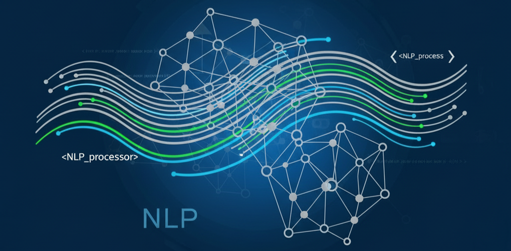
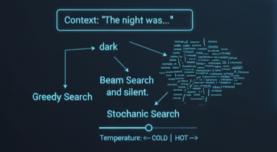
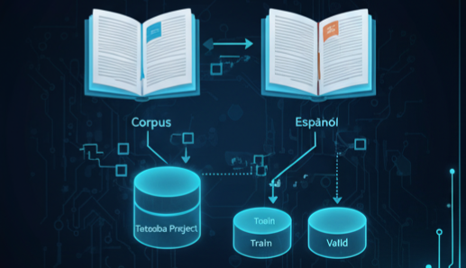

  

# 🤖 CEIA_2025_B4_PNL1_TP

Curso de Especialización en Inteligencia Artificial  
Año 2025  
Bimestre 4  

## Procesamiento del Lenguaje Natural 1  

  

## Docentes:
* Rodrigo Cardenas Szigety
* Mauro Bringas

## Autor:
* Viñas Gustavo

### Este repositorio contiene el Trabajo Práctico de la materia Procesamiento de Lenguaje Natural I, correspondiente al Curso de Especialización en Inteligencia Artificial de la Facultad de Ingeniería de Buenos Aires.

### El objetivo principal de este proyecto es aplicar los conocimientos adquiridos en el transcurso de la materia a cuatro desafíos planteados.

## Desafío 1

  

Exploración con diferentes técnicas de representación numérica de texto (documentos y palabras). Aplicación a tareas de clasificación y análisis de similaridad.
* Vectorización y Análisis de Similaridad de Documentos
* Clasificación por Prototipos
* Optimización de Clasificadores Naïve Bayes
* Vectorización y Análisis de Similaridad de Palabras

Link: [Notebook Desafio_1](Desafio_1.ipynb) / [Colab Desafio_1](https://colab.research.google.com/github/gjmv/CEIA_2025_B4_PNL1_TP/blob/main/Desafio_1.ipynb)

## Desafío 2

  

Aplicación de técnicas de embeddings de palabras a un texto para comprender las relaciones léxicas y semánticas intrínsecas a esa obra específica.
* Generación de Embeddings con Gensim
* Análisis de Similitudes de Términos
* Visualización Gráfica
* Conclusiones

Link: [Notebook Desafio_2](Desafio_2.ipynb) / [Colab Desafio_2](https://colab.research.google.com/github/gjmv/CEIA_2025_B4_PNL1_TP/blob/main/Desafio_2.ipynb)

## Desafío 3

  

Construcción de un modelo de generación de texto y análisis de cómo distintas estrategias de muestreo influyen en la calidad del lenguaje generado.
* Preparación del Corpus y Datos
* Modelado y Entrenamiento
* Generación de Secuencias
* Conclusiones

Link: [Notebook Desafio_3](Desafio_3.ipynb) / [Colab Desafio_3](https://colab.research.google.com/github/gjmv/CEIA_2025_B4_PNL1_TP/blob/main/Desafio_3.ipynb)

## Desafío 4
![img ]

  

Construcción de un modelo de traducción de inglés a español utilizando una arquitectura seq2seq (encoder-decoder), basándose en los datos del Tatoeba Project, implementado en Pytorch.
* Tokenización
* Embeddings pre-entrenados y no entrenados
* Implementación modelo seq2seq
* Modelado y Entrenamiento
* Exploración de Hiperparámetros
* Demostración de Traducciones

Link: [Notebook Desafio_4](Desafio_4.ipynb) / [Colab Desafio_4](https://colab.research.google.com/github/gjmv/CEIA_2025_B4_PNL1_TP/blob/main/Desafio_4.ipynb)  
Debido a limitaciones de memoria, se realizó una versión limitada para ejecución en colab: [Notebook Desafio_4_colab](Desafio_4_colab.ipynb) / [Colab Desafio_4_colab](https://colab.research.google.com/github/gjmv/CEIA_2025_B4_PNL1_TP/blob/main/Desafio_4_colab.ipynb)

